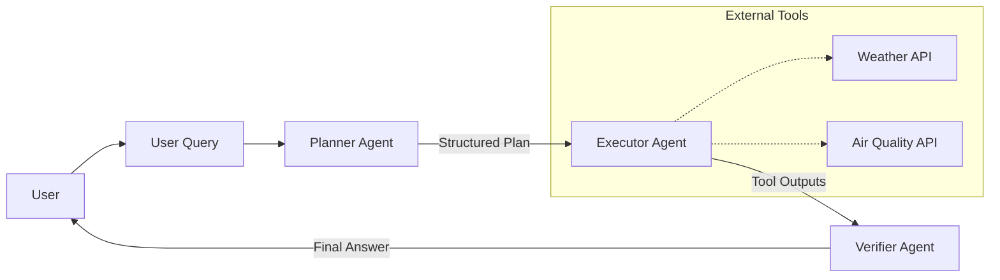

# 🌤️ AI Weather & Air Quality Agent

> An intelligent, multi-agent system that plans, executes, and verifies weather and air quality tasks using OpenAI and LangGraph.


---

## 📖 Overview

This project implements a robust **Planner-Executor-Verifier** agentic workflow. Instead of simply calling a tool, the system:
1.  **Plans** a step-by-step approach to answer your query.
2.  **Executes** the necessary tools (Weather API, Air Quality API).
3.  **Verifies** the results and synthesizes a natural language response.

It features both a **Command Line Interface (CLI)** and a modern **Streamlit Web UI**.

---

## 🏗️ Architecture



---

## 🚀 Getting Started

### 1. Prerequisites
- **Python 3.10+**
- **[uv](https://github.com/astral-sh/uv)** (Recommended) or `pip`
- **API Keys**: OpenAI & OpenWeatherMap

### 2. Installation

Clone the repository and install dependencies:

**Option A: Using uv (Fast & Recommended)**
```bash
uv venv
# Windows:
.venv\Scripts\activate
# Mac/Linux:
source .venv/bin/activate

uv pip install -r requirements.txt
```

**Option B: Using standard pip**
```bash
python -m venv .venv
# Windows:
.venv\Scripts\activate
# Mac/Linux:
source .venv/bin/activate

pip install -r requirements.txt
```

### 3. Configuration

1.  **Create Environment File**:
    ```bash
    cp .env.example .env
    ```
2.  **Add Credentials** to `.env`:
    ```properties
    OPENAI_API_KEY=sk-...         # Your OpenAI API Key
    OPENWEATHER_API_KEY=...       # Your OpenWeatherMap Key
    OPENAI_MODEL=gpt-4o-mini      # (Optional) Default model
    ```

---

## � Integrated APIs

- **[OpenAI API](https://platform.openai.com/)**: Used for the core reasoning engine (Planner, Verifier) and natural language generation.
- **[OpenWeatherMap API](https://openweathermap.org/api)**:
    - **Current Weather Data**: Real-time temperature and conditions.
    - **Air Pollution API**: Real-time Air Quality Index (AQI) and pollutant components.

---

## �🖥️ Usage

### 🎨 Web Interface (Streamlit)
The best way to interact with the agent.
```bash
streamlit run app.py
```
*Opens automatically in your browser at `http://localhost:8501`*

### ⌨️ Command Line
For quick terminal interactions.
```bash
python main.py
```

---

## 💡 Example Prompts

Try these to see the agent functionalities in action:

| Type | Prompt |
| :--- | :--- |
| **Combined** | *"What is the weather and air quality in New York?"* |
| **Weather** | *"Check the current temperature in London."* |
| **Pollution** | *"How is the pollution level in Delhi right now?"* |
| **Specific** | *"Get me the weather report for Tokyo."* |
| **Complex** | *"I need to know if it's raining and what the AQI is in Paris."* |

---

## ⚠️ Known Limitations & Tradeoffs

- **Rate Limits**: The OpenWeatherMap free tier has request limits. Heavy usage may cause API errors.
- **Sequential Execution**: Currently, the planner executes tools sequentially. Parallel execution would improve performance for complex queries.
- **Session Memory**: The agent does not maintain context between different queries (stateless).
- **Error Recovery**: While basic retries are implemented, complex network failures might simply report an error rather than recovering intelligently.

---

## 📂 Project Structure

- `agents/`: Core logic for Planner, Executor, and Verifier agents.
- `tools/`: Integrations with external APIs (OpenWeatherMap).
- `llm/`: Configuration for the Language Model.
- `app.py`: Streamlit frontend application.
- `main.py`: LangGraph workflow definition and CLI entry point.
